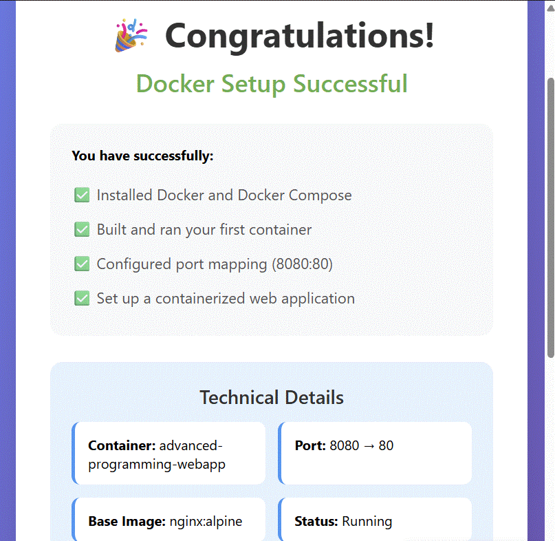

# Git + Docker Sprint · `git-docker-sprint`
[](https://github.com/KatieBarnes147/git-docker-sprint/actions/workflows/secret-scan.yml)

This project demonstrates version control best practices with **Git/GitLab** and containerization using **Docker Compose**.  
Originally developed for graduate coursework, now polished for portfolio showcase.

---

## 🎯 Project Overview
Apply core **Git workflow** skills (branching, merging, reverting, closing issues via commit messages) while also learning how to **containerize a simple Python app** and run it with **Docker Compose**.

**Key deliverables**
- ✅ Implemented a `doubleIt` function in Python  
- ✅ Managed branches and resolved merge conflicts  
- ✅ Used `git revert` to preserve history while correcting mistakes  
- ✅ Built and ran a containerized web app with a success page  
- ✅ Auto-closed issues via commit messages  
- ✅ Wrote a sprint reflection in Markdown

---

## 🔧 Tech Stack
- **Git & GitLab/GitHub** (version control, PRs/MRs)  
- **Python 3 (Flask)**  
- **Docker & Docker Compose**  
- **Markdown** for docs

---

## 🚀 Quick Start

### Prerequisites
- Docker Desktop (or Docker Engine + Compose)  
- Python 3 (only needed to run locally without Docker)

### Setup Environment
**PowerShell (Windows)**
```powershell
Copy-Item .env.example .env
bash (macOS/Linux/Git Bash)

bash
Copy code
cp .env.example .env
You can keep the defaults (PORT=5000).

Run with Docker
bash
Copy code
docker compose up --build
# If you have the older plugin:
# docker-compose up --build
Then open: http://localhost:5000 🎉
(If your container maps ports as 8080:80, use http://localhost:8080 instead.)

Run locally (no Docker)
bash
Copy code
pip install -r requirements.txt
python app.py

🖼️ Screenshot



📚 What I Learned
Using git revert to fix mistakes without rewriting history

Step-by-step merge conflict resolution

Auto-closing issues with commit messages (e.g., Fixes #123)

Containerizing a Python app with a minimal Compose setup

Keeping repos clean with .gitignore and .env.example

🔒 Security
This repo is sanitized; no real secrets are committed.

Real .env files are ignored

Example config lives in .env.example (safe placeholders)

Server-side scanning: Gitleaks runs on every push/PR via GitHub Actions

Optional local scan (PowerShell)

powershell
Copy code
docker run --rm -v "$($PWD.Path):/repo" -w /repo zricethezav/gitleaks:latest detect --no-git --redact
Optional local scan (bash)

bash
Copy code
docker run --rm -v "$PWD:/repo" -w /repo zricethezav/gitleaks:latest detect --no-git --redact
🗂️ Project Structure (minimal)
bash
Copy code
.
├─ app.py              # simple Python endpoint / success page
├─ requirements.txt    # Flask dependency
├─ docker-compose.yml  # compose service definition
├─ Dockerfile          # image build for the app
├─ .env.example        # safe placeholders
├─ README.md
└─ docs/
   └─ success.png      # screenshot used in the README
🤔 Next Steps
Add a basic CI job to run unit tests (pytest)

Extend the app beyond a simple success page

Explore CI/CD pipelines (GitHub Actions or GitLab Auto DevOps)

✍️ Author
Katie Barnes — M.S. Computer Science & Software Engineering
GitHub: @KatieBarnes147


